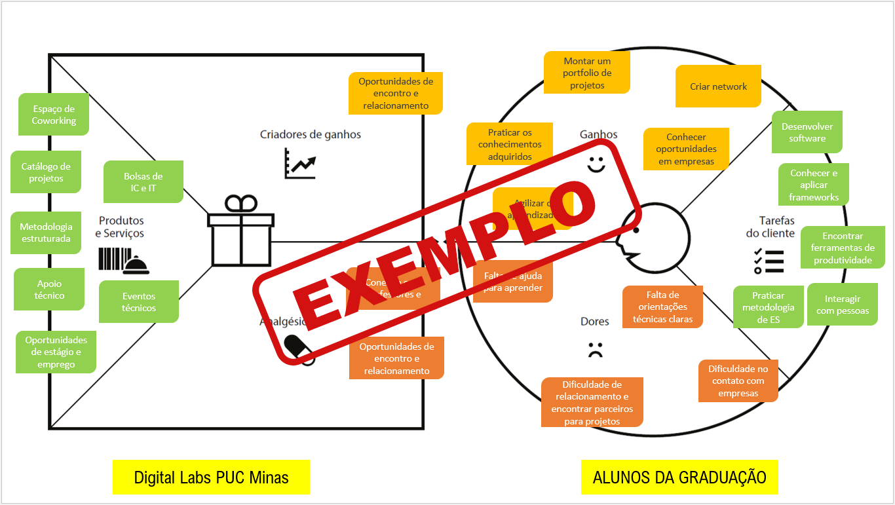

# Product design

Pré-requisitos: <a href="02-Product-discovery.md"> Product discovery</a>

> ⚠️ **APAGUE ESTA PARTE ANTES DE ENTREGAR SEU TRABALHO**

Neste momento, transformam-se os insights e validações obtidos em soluções tangíveis e utilizáveis. Esta fase envolve a definição de uma proposta de valor, detalhando a prioridade de cada ideia, e a consequente criação de wireframes, mockups e protótipos de alta fidelidade, que especificam a interface e a experiência do usuário.

## Histórias de usuários

Com base na análise das personas, foram identificadas as seguintes histórias de usuários:

|EU COMO... `PERSONA`| QUERO/PRECISO ... `FUNCIONALIDADE` |PARA ... `MOTIVO/VALOR`                 |
|--------------------|------------------------------------|----------------------------------------|
|Idoso.  | Um profissional qualificado para me acompanhar e me ajudar com minhas tarefas.         | Estou sozinha, distante da minha família, tenho limitações pela idade e preciso de alguém que me faça companhia e saiba me socorrer em caso de emergência.                |
|Filha.       | Uma pessoa de confiança e capaz para ajudar minha mãe que é muito solitária e tem necessidade de cuidados.         | Eu não consigo estar sempre próximo dela.  |
|Cuidador de idosos.       | Demonstrar minhas capacidades, todos os cursos e treinamentos que eu fiz.        | Para me destacar, ser contratado e receber um retorno financeiro conforme minha qualificação.   |
|Filho.       | Solicitar os serviços de um cuidador de idosos para auxiliar o meu pai quando eu estiver distante.         | Meu pai necessita de ajuda na sua rotina diária. Ele tem dificuldade para caminhar, lembrar de tomar remédios e se alimentar.   |
|Idoso.       | Ajuda para ir e voltar do supermercado.         | Preciso de suporte para carregar as compras e pedir um Uber.  |
|Cuidador de idosos.       | Encontrar oportunidades de emprego mais próximas da minha casa e de melhor remuneração.         | Minha remuneração é muito prejudicada pelos custos de deslocamento do meu trabalho atual. |
|Idosa.       | Alguém para me ajudar nas minhas tarefas domésticas que exigem um esforço maior.        | Tenho um problema no joelho e isso me enfraquece. Não consigo, por exemplo, varrer a varanda.  |

> ⚠️ **APAGUE ESTA PARTE ANTES DE ENTREGAR SEU TRABALHO**

Apresente aqui as histórias de usuários que são relevantes para o projeto da sua solução. As histórias de usuários consistem em uma ferramenta poderosa para a compreensão e elicitação dos requisitos funcionais e não funcionais da sua aplicação. Se possível, agrupe as histórias de usuários por contexto, para facilitar consultas recorrentes a esta parte do documento.

> **Links úteis**:
> - [Histórias de usuários com exemplos e template](https://www.atlassian.com/br/agile/project-management/user-stories)
> - [Como escrever boas histórias de usuário (user stories)](https://medium.com/vertice/como-escrever-boas-users-stories-hist%C3%B3rias-de-usu%C3%A1rios-b29c75043fac)
> - [User stories: requisitos que humanos entendem](https://www.luiztools.com.br/post/user-stories-descricao-de-requisitos-que-humanos-entendem/)
> - [Histórias de usuários: mais exemplos](https://www.reqview.com/doc/user-stories-example.html)
> - [9 common user story mistakes](https://airfocus.com/blog/user-story-mistakes/)

## Proposta de valor

**✳️✳️✳️ APRESENTE O DIAGRAMA DA PROPOSTA DE VALOR PARA CADA PERSONA ✳️✳️✳️**

##### Proposta para a persona XPTO ⚠️ EXEMPLO ⚠️

> ⚠️ **APAGUE ESTA PARTE ANTES DE ENTREGAR SEU TRABALHO**
>
> O mapa da proposta de valor é uma ferramenta que auxilia na definição do tipo de produto ou serviço que melhor atende às personas previamente estabelecidas.

> **Links úteis**:
> - [O que é o canvas da proposta de valor e como usar?](https://www.youtube.com/watch?v=Iqb-8Q_eiiA)

## Requisitos

As tabelas a seguir apresentam os requisitos funcionais e não funcionais que detalham o escopo do projeto. Para determinar a prioridade dos requisitos, aplique uma técnica de priorização e detalhe como essa técnica foi aplicada.

### Requisitos funcionais

| ID     | Descrição do Requisito                                   | Prioridade |
| ------ | ---------------------------------------------------------- | ---------- |
| RF-001 | Permitir o cadastro e criação de perfis para clientes e profissionais | ALTA    |
| RF-002 | Filtro para escolha e contratação dos profissionais | MEDIA     |
| RF-003 | Permitir que o usuário poste os serviços desejados | ALTA     |
| RF-004 | Barra de pesquisa para buscar informações e transitar entre as páginas |MEDIA     |
| RF-005 | Permitir avaliação de clientes e profissionais | ALTA     |
| RF-006 | Slide  | MEDIA     |
| RF-007 | Banner | MEDIA    |
| RF-008 | Formas de pagamento | ALTA     |
| RF-009 | Página de administrador | ALTA     |
| RF-010 | Cards com serviços disponíveis para o cuidador | ALTA     |

### Requisitos não funcionais

| ID      | Descrição do Requisito                                                              | Prioridade |
| ------- | ------------------------------------------------------------------------------------- | ---------- |
| RNF-001 | O sistema vai ter portabilidade com dispositivos moveis em geral, principamente mobile e desktops, com interfaces responsivas.                                                                        | MÉDIA      |
| RNF-002 | Ser intuitivo e acessível, especialmente especialmente para os idosos, com uma interface limpa botoes bem visiveis.                                                                           | ALTA     |
| RNF-003 | Sistema disponivel 100% do tempo para todas as aplicações do site.      | MEDIA      |
| RNF-004 | Linguagem HTML, CSS, JSON e JavaScript.                                 | MEDIA      |
| RNF-005 | O site será disponibilizado no Git Hub, uma plataforma dehospedagem de código fonte e arquivoscom controle de versão usando o Git.                                                                                | ALTA     |
| RNF-006 | A fonte das letras deve seracessível para os idosos com baixavisão.       | ALTA      |

> ⚠️ **APAGUE ESTA PARTE ANTES DE ENTREGAR SEU TRABALHO**
>
> Com base nas histórias de usuários, enumere os requisitos da sua solução. Classifique esses requisitos em dois grupos:

- [Requisitos funcionais
 (RF)](https://pt.wikipedia.org/wiki/Requisito_funcional):
 correspondem a uma funcionalidade que deve estar presente na
  plataforma (ex: cadastro de usuário).
- [Requisitos não funcionais
  (RNF)](https://pt.wikipedia.org/wiki/Requisito_n%C3%A3o_funcional):
  correspondem a uma característica técnica, seja de usabilidade,
  desempenho, confiabilidade, segurança ou outro (ex: suporte a
  dispositivos iOS e Android).

Lembre-se de que cada requisito deve corresponder a uma e somente uma característica-alvo da sua solução. Além disso, certifique-se de que todos os aspectos capturados nas histórias de usuários foram cobertos.

> **Links úteis**:
> - [O que são requisitos funcionais e requisitos não funcionais?](https://codificar.com.br/requisitos-funcionais-nao-funcionais/)
> - [Entenda o que são requisitos de software, a diferença entre requisito funcional e não funcional, e como identificar e documentar cada um deles](https://analisederequisitos.com.br/requisitos-funcionais-e-requisitos-nao-funcionais-o-que-sao/)

## Restrições

Enumere as restrições à sua solução. Lembre-se de que as restrições geralmente limitam a solução candidata.

O projeto está restrito aos itens apresentados na tabela a seguir.

|ID| Restrição                                             |
|--|-------------------------------------------------------|
|001| O prazo de entrega será até o dia 8 de Dezembro. | 
|002| A apresentação do projeto será dia 10 de Dezembro. |
|003| Bootstrap só poderá ser utilizado sob consulta e não será considerado requisito de entrega.  |
|004| Não será permitido utilizar back-end no projeto.  |

