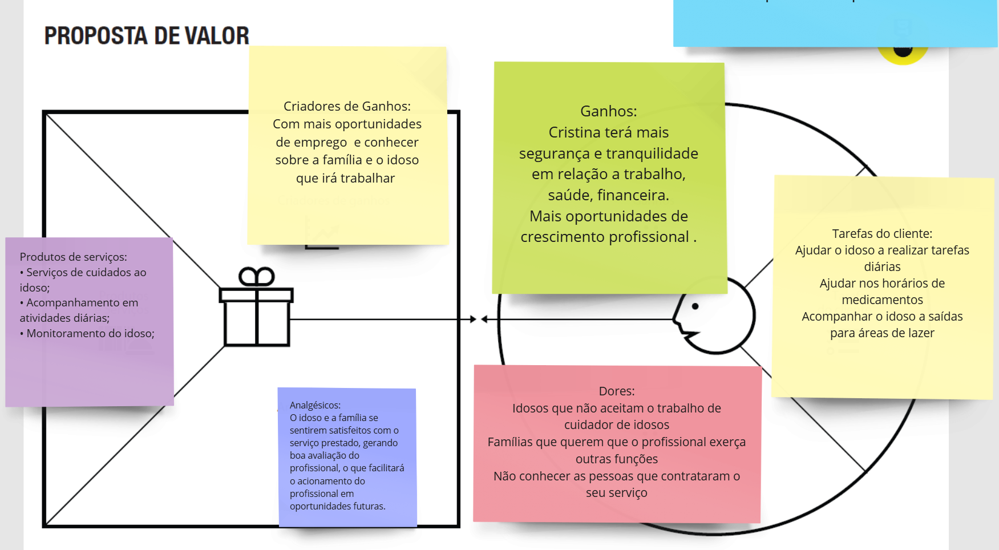

  # Product design

## Histórias de usuários

Com base na análise das personas, foram identificadas as seguintes histórias de usuários:

 |EU COMO... `PERSONA`| QUERO/PRECISO ... `FUNCIONALIDADE` |PARA ... `MOTIVO/VALOR`                 |

Eu como idoso quero um profissional qualificado para me acompanhar e me ajudar com minhas tarefas, porque estou sozinha, distante da minha família, tenho limitações pela idade e preciso de alguém que me faça companhia e saiba me socorrer em caso de emergência.             

Eu como filha quero uma pessoa de confiança e capaz para ajudar minha mãe que é muito solitária e tem necessidade de cuidados porque eu não consigo estar sempre próximo dela.

Eu como cuidador de idosos quero demonstrar minhas capacidades, todos os cursos e treinamentos que eu fiz, para me destacar, ser contratado e receber um retorno financeiro conforme minha qualificação.

Eu como filho quero solicitar os serviços de um cuidador de idosos para auxiliar o meu pai quando eu estiver distante, porque meu pai necessita de ajuda na sua rotina diária. Ele tem dificuldade para caminhar, lembrar de tomar remédios e se alimentar.

Eu como idoso quero ajuda para ir e voltar do supermercado, porque preciso de suporte para carregar as compras e pedir um Uber.

Eu como cuidador de idosos quero encontrar oportunidades de emprego mais próximas da minha casa e de melhor remuneração, porque minha remuneração é muito prejudicada pelos custos de deslocamento do meu trabalho atual.

Eu como idosa quero alguém para me ajudar nas minhas tarefas domésticas que exigem um esforço maior, porque tenho um problema no joelho e isso me enfraquece. Não consigo, por exemplo, varrer a varanda.

Eu como filho quero alguém que ajude minha mãe a mexer no Uber, porque não estou sempre por perto e não tenho tempo suficiente para ensiná-la com paciência.

Eu como fisioterapeuta quero expandir os meus clientes, para fazer uma renda extra e atender quem necessitar do meu trabalho.

Eu como filha quero ter a certeza de que minha mãe está bem assistida, recebendo os cuidados e ajudas necessários, porque fico muito preocupada com a segurança e o bem-estar da minha mãe, especialmente porque não posso visitála com frequência.

Eu como cuidadora de idosos quero encontrar oportunidades de trabalho na minha área, porque acabei de me formar como técnica na área de assistência aos idosos.

Eu como administrador de um lar para idosos quero otimizar o gerenciamento dos serviços oferecidos pelo meu negócio e encontrar mais cuidadores, porque busco eficiência e qualidade na administração da instituição.

Eu como cuidador de idosos quero ter mais praticidade na hora de procurar um emprego, porque não consigo emprego na minha área com facilidade.

Eu como idoso quero melhorar meu contato com redes sociais e ter mais acesso a notícias e jornais digitais, porque tenho o costume e interesse desde jovem de me informar sobre diversos assuntos.

## Proposta de valor

##### Proposta para a persona Cláudia Barcelos

##### Proposta para a persona Maria Mercedes

##### Proposta para a persona Cristina Ferraz

##### Proposta para a persona Geraldo

##### Proposta para a persona Filomena da Silva

## Requisitos

As tabelas a seguir apresentam os requisitos funcionais e não funcionais que detalham o escopo do projeto: 

### Requisitos funcionais

| ID     | Descrição do Requisito                                   | Prioridade |
| ------ | ---------------------------------------------------------- | ---------- |
| RF-001 | Permitir o cadastro e criação de perfis para clientes e profissionais | ALTA    |
| RF-002 | Filtro para escolha e contratação dos profissionais | MEDIA     |
| RF-003 | Permitir que o usuário poste os serviços desejados | ALTA     |
| RF-004 | Barra de pesquisa para buscar informações e transitar entre as páginas |MEDIA     |
| RF-005 | Permitir avaliação de clientes e profissionais | ALTA     |
| RF-006 | Carrosel com slides que encaminham para páginas do site  | MEDIA     |
| RF-007 | Banner para tutoriais de alertas contra golpes digitais | MEDIA    |
| RF-008 | Formas de pagamento | ALTA     |
| RF-009 | Página de administrador | ALTA     |
| RF-010 | Cards com serviços disponíveis para o cuidador | ALTA     |
| RF-011 | Login (e-mail e senha) | ALTA     |

### Requisitos não funcionais

| ID      | Descrição do Requisito                                                              | Prioridade |
| ------- | ------------------------------------------------------------------------------------- | ---------- |
| RNF-001 | O sistema vai ter portabilidade com dispositivos movéis em geral, principamente mobile e desktops, com interfaces responsivas.                                                                        | MÉDIA      |
| RNF-002 | Ser intuitivo e acessível, especialmente para os idosos, com uma interface limpa e botoes bem visiveis.                                                                           | ALTA     |
| RNF-003 | Sistema disponivel 100% do tempo para todas as aplicações do site.      | MEDIA      |
| RNF-004 | Linguagem HTML, CSS, JSON e JavaScript.                                 | MEDIA      |
| RNF-005 | O site será disponibilizado no Git Hub, uma plataforma de hospedagem de código fonte e arquivos com controle de versão usando o Git.                                                                                | ALTA     |
| RNF-006 | A fonte das letras deverá ser boa e acessível para os idosos com baixa visão.       | ALTA      |

## Restrições

O projeto está restrito aos itens apresentados na tabela a seguir:

|ID| Restrição                                             |
|--|-------------------------------------------------------|
|001| O prazo de entrega será até o dia 8 de Dezembro. | 
|002| A apresentação do projeto será dia 10 de Dezembro. |
|003| Bootstrap só poderá ser utilizado sob consulta e não será considerado requisito de entrega.  |
|004| Não será permitido utilizar back-end no projeto.  |

