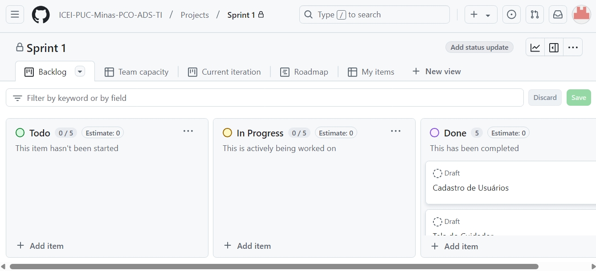
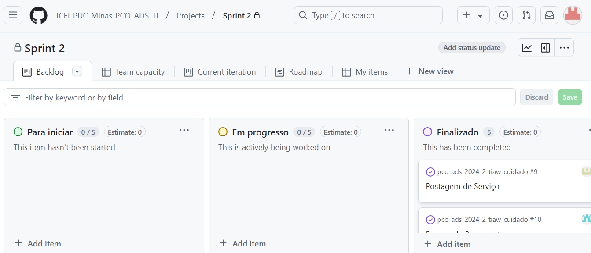
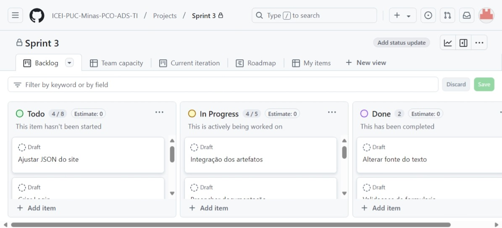

# Metodologia Cuidado+

Pré-requisitos: <a href="03-Product-design.md"> Product design</a>

Para o desenvolvimento do projeto Cuidado+, seguimos uma metodologia estruturada em etapas que garantiram a organização, alinhamento com os objetivos e a colaboração da equipe.

Definição do projeto
Iniciamos com a elaboração das definições principais do projeto, criando um mapa de stakeholders e realizando o alinhamento de CSD (Certezas, Suposições e Dúvidas). Essa etapa foi essencial para estabelecer um direcionamento claro.

Entrevistas qualitativas e análise do público
Realizamos entrevistas qualitativas com o objetivo de identificar as dores e necessidades do nosso público-alvo. A partir dessas informações, desenvolvemos personas representativas baseadas em nossas pesquisas de campo, detalhando os ganhos, dores e os principais aspectos nos quais eles necessitam de suporte.

Criação de protótipos
Utilizamos a plataforma Figma para criar protótipos que serviram como guia visual e funcional para a construção do site. Esses protótipos ajudaram a validar ideias e manter a equipe alinhada quanto ao design e à usabilidade do produto final.

Planejamento dos artefatos e divisão do trabalho
Definimos 10 artefatos essenciais para o site, organizados em duas etapas (sprints). Cada integrante da equipe ficou responsável por desenvolver dois artefatos durante as sprints, utilizando o VS Code como ferramenta principal.

Controle de versionamento e documentação
O repositório do projeto foi gerenciado no GitHub, onde armazenamos os códigos de cada artefato e toda a documentação associada. Utilizamos o sistema de kanban integrado para monitorar o progresso de cada artefato e identificar seu status no fluxo de desenvolvimento.

Essa abordagem metodológica garantiu que o projeto fosse desenvolvido de forma colaborativa, organizada e com foco nas necessidades reais do público-alvo.

## Relação de ambientes de trabalho

Os artefatos do projeto são desenvolvidos a partir de diversas plataformas. A relação dos ambientes com seus respectivos propósitos deverá ser apresentada em uma tabela que especifique e detalhe Ambiente, Plataforma e Link de Acesso. Defina também os ambientes e frameworks que serão utilizados no desenvolvimento de aplicações móveis.

## Controle de versão

A ferramenta de controle de versão adotada no projeto foi o [Git](https://git-scm.com/), sendo que o [GitHub](https://github.com) foi utilizado para hospedagem do repositório.

O projeto segue a seguinte convenção para o nome de branches:

- `main`: versão definitiva e já testada do software
- `develop`: versão de desenvolvimento da integração do software
- `documentação`: versão de preenchimento da documentação do projeto
- `Avaliações---Franklin`: versão de desenvolvimento da página de avaliações de usuários
- `Banner---Ivan`: versão de desenvolvimento do banner localizado na página de tutoriais
- `Carrossel`: versão de desenvolvimento do carrossel localizado na página Home
- `Filtro-Rodrigo`: versão de desenvolvimento do filtro para a contratação profissionais
- `Formas-de-Pagamento---Lucas`: versão de desenvolvimento da página de efetuações de pagamento
- `Página-de-Administrador---Erik`: versão de desenvolvimento do painel de administrador
- `Postagem-de-serviço---Rodrigo`: versão de desenvolvimento do formulário de cadastro de serviço por parte dos clientes

Quanto à gerência de issues, o projeto adota a seguinte convenção para etiquetas:

- `Cadastro de Usuários`: funcionalidade da Sprint 1 a ser implementada
- `Tela do Cuidador`: funcionalidade da Sprint 1 a ser implementada
- `Filtro para escolher um profissional`: funcionalidade da Sprint 1 a ser implementada
- `Carrossel`: funcionalidade da Sprint 1 a ser implementada
- `Barra de pesquisa`: funcionalidade da Sprint 1 a ser implementada
- `Banner`: funcionalidade da Sprint 2 a ser implementada
- `Avaliações`: funcionalidade da Sprint 2 a ser implementada
- `Formas-de-Pagamento`: funcionalidade da Sprint 2 a ser implementada
- `Página-de-Administrador`: funcionalidade da Sprint 2 a ser implementada
- `Postagem-de-serviço`: funcionalidade da Sprint 2 a ser implementada
- `Ajustar JSON do site`: tarefa da Sprint 3 a ser realizada
- `Criar Login`:  tarefa da Sprint 3 a ser realizada
- `Implementar perfil no site`:  tarefa da Sprint 3 a ser realizada
- `Corrigir Banner`:  tarefa da Sprint 3 a ser realizada
- `Integração dos artefatos`:  tarefa da Sprint 3 a ser realizada
- `Preencher documentação`:  tarefa da Sprint 3 a ser realizada
- `Responsividade das páginas`:  tarefa da Sprint 3 a ser realizada
- `Realizar o link das páginas`:  tarefa da Sprint 3 a ser realizada
- `Alterar fonte do texto`:  tarefa da Sprint 3 a ser realizada
- `Validações de formulário`:  tarefa da Sprint 3 a ser realizada

Discuta como a configuração do projeto foi feita na ferramenta de versionamento escolhida. Exponha como a gestão de tags, merges, commits e branches é realizada. Discuta também como a gestão de issues foi feita.

As branches de requisitos funcionais foram direcionadas para seus respectivos desenvolvedores. Quanto a branch develop, ela foi criada para a realização da integração do site por meio da união e manutenção das branches de requisitos funcionais. Feita essa integração, operou-se a merge entre a main e a develop e os últimos ajustes no código direto na main.

A branch de documentação foi criada unicamente para o preechimento da documentção do projeto. Após tal preenchimento, operou-se merge entre ela e a main.

A gerência de issues ocorreu conforme a divisão das sprints do projeto: 
- Sprint 1 e seus 5 (cinco) requisitos funcionais;
- Sprint 2 e seus 5 (cinco) requisitos funcionais;  
- Sprint 3 e sua integração completa do site acompanha do preenchimento da documentação do projeto; 

## Planejamento do projeto

###  Divisão de papéis

⚠️ **APAGUE ESTA PARTE ANTES DE ENTREGAR SEU TRABALHO**

A equipe utiliza o Scrum como base para definição do processo de desenvolvimento.

- Scrum Master: Ivan Barreto.
- Product Owner: Rodrigo Falcão e Franklin Reis e Lucas Puggina.
- Equipe de Desenvolvimento: Ivan Barreto, Rodrigo Falcão, Franklin Reis, Erik Alcântara e Lucas Puggina.
- Equipe de Design: Erik Alcântara.

### Processo 

GitHub Projects: 

https://github.com/orgs/ICEI-PUC-Minas-PCO-ADS-TI/projects/23/views/1

https://github.com/orgs/ICEI-PUC-Minas-PCO-ADS-TI/projects/20

https://github.com/orgs/ICEI-PUC-Minas-PCO-ADS-TI/projects/22

### Ferramentas

Liste todas as ferramentas que foram empregadas no projeto, justificando a escolha delas, sempre que possível. Inclua itens como: (1) editor de código, (2) ferramentas de comunicação, (3) ferramentas de diagramação, (4) plataformas de hospedagem, entre outras.

⚠️ EXEMPLO ⚠️ os artefatos do projeto são desenvolvidos a partir de diversas plataformas e a relação dos ambientes com seu respectivo propósito é apresentada na tabela que se segue.

| Ambiente                            | Plataforma                         | Link de acesso                       |
|-------------------------------------|------------------------------------|--------------------------------------|
| Processo de Design Thinking         | Miro                               | https://....   ⚠️ EXEMPLO ⚠️        |
| Repositório de código fonte         | GitHub                             | https://....   ⚠️ EXEMPLO ⚠️        |
| Documentos do projeto               | GitHub                             | http://....    ⚠️ EXEMPLO ⚠️        |
| Gerenciamento do projeto            | GitHub Projects                    | http://....    ⚠️ EXEMPLO ⚠️        |
| Projeto de interface                | Figma                              | http://....    ⚠️ EXEMPLO ⚠️        |
| Hospedagem                          | Vercel                             | http://....    ⚠️ EXEMPLO ⚠️        |
 
