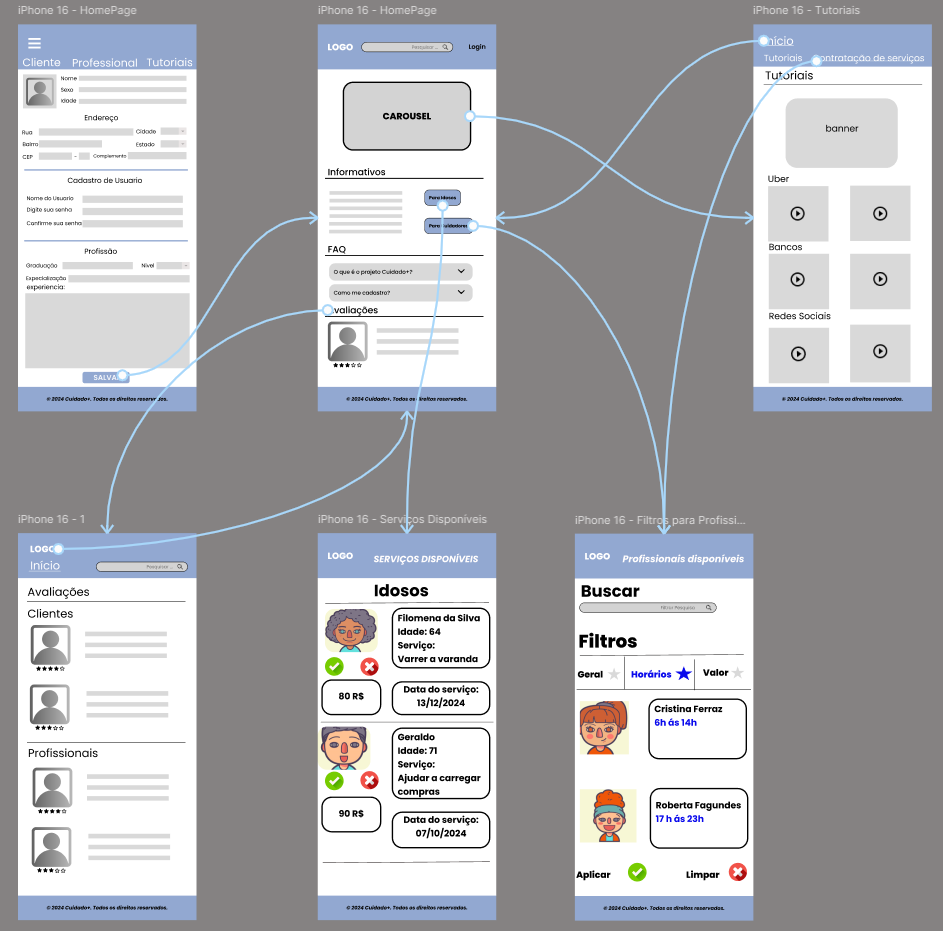
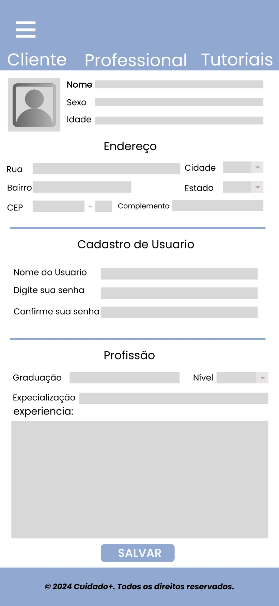
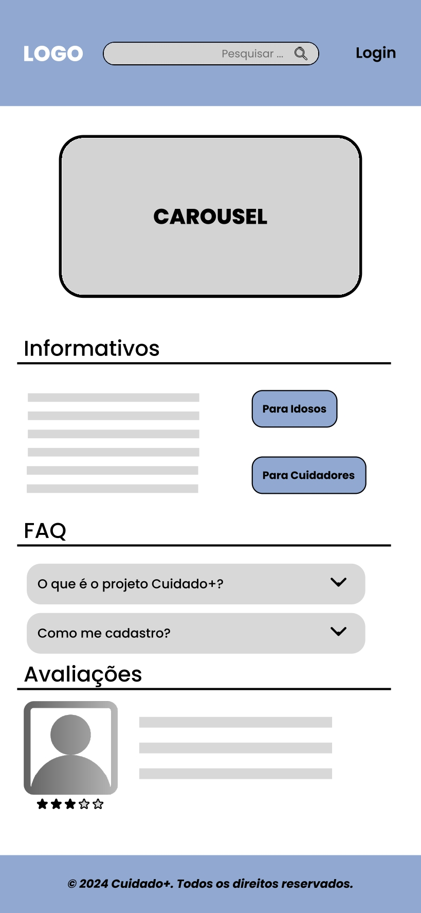
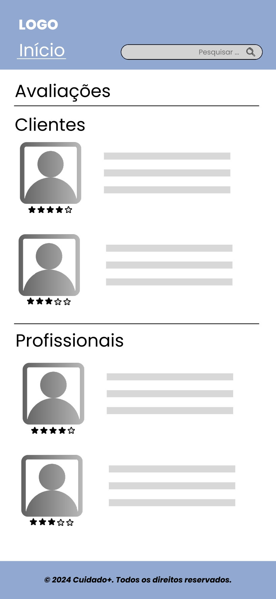
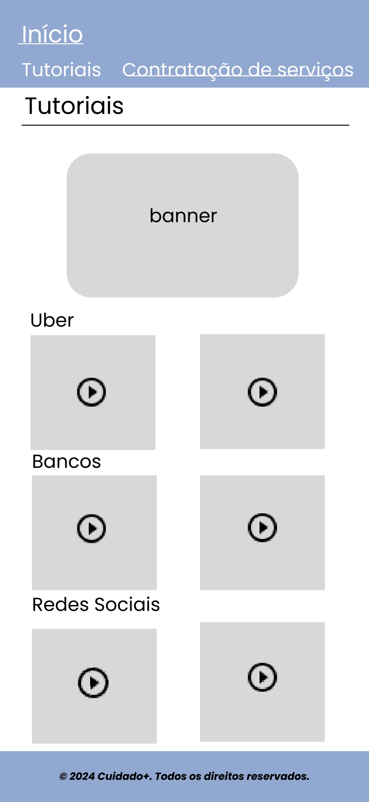
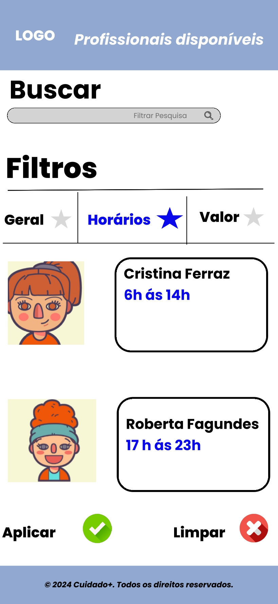
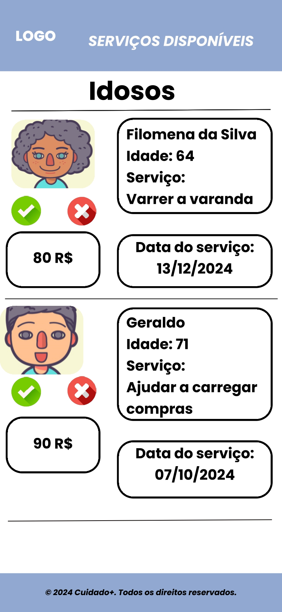

# Projeto de interface

Pré-requisitos: <a href="03-Product-design.md"> product design</a>

 Visão geral da interação do usuário pelas telas do sistema e protótipo interativo das telas com as funcionalidades que fazem parte do sistema (wireframes).

 Apresente as principais interfaces da plataforma. Discuta como ela foi elaborada de forma a atender os requisitos funcionais, não funcionais e histórias de usuário abordados na parte de <a href="03-Product-design.md"> product design</a>.

 ## User flow

## Wireframes

##### Cadastro de Usuário

A tela de cadastro permite que o usuário crie um perfil pessoal, fornecendo informações básicas necessárias para acessar o site. É um passo inicial antes do login e garante a personalização e segurança da conta.

##### Página Inicial

A tela inicial apresenta informações gerais sobre o site por meio de textos informativos e elementos interativos, como botões e um carrossel de imagens. Esses recursos facilitam a navegação, direcionando o usuário para diferentes seções e funcionalidades do site.

##### Avaliações dos Usuários

A tela de avaliações permite que o usuário visualize feedbacks e classificações deixados por outros usuários do site, sejam eles idosos ou profissionais. Essa funcionalidade ajuda a criar confiança e a facilitar escolhas informadas sobre os serviços disponíveis.

##### Tutoriais Práticos

A página de tutoriais oferece instruções claras e simplificadas para auxiliar os usuários em tarefas do dia a dia, como utilizar aplicativos de transporte, entre outros. O objetivo é promover a autonomia e facilitar o aprendizado de novas tecnologias e ferramentas.

##### Contratar Profissionais

Esta página permite que o usuário encontre e contrate profissionais específicos, de acordo com suas necessidades. É uma ferramenta prática para conectar cuidadores e clientes de forma rápida e eficiente.

##### Gerenciamento de Serviços

Nesta página, os profissionais podem visualizar e aceitar solicitações de serviços enviadas pelos idosos. É o ponto de conexão para iniciar o atendimento de forma organizada e eficiente.

### Protótipo Interativo

✅ [Protótipo interativo](https://www.figma.com/proto/GOrsjO7zJH1fKIcQRKxlCc/WIREFRAME?node-id=231-58&node-type=canvas&t=f9nTnjQPAxkgOrUa-1&scaling=scale-down&content-scaling=fixed&page-id=39%3A26) 