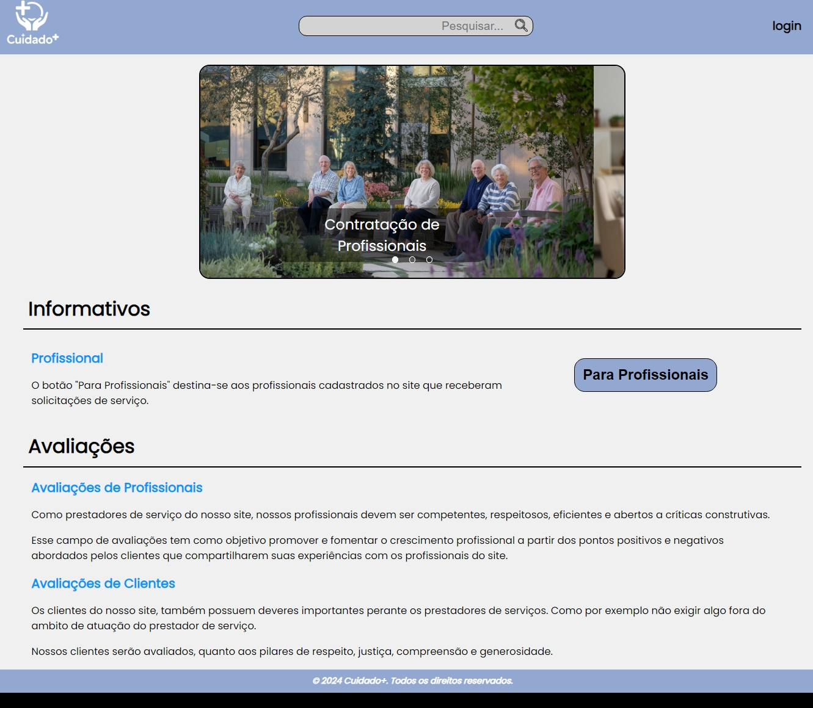

# Template padrão da aplicação

Cabeçalho - background: #92A8D1 e logomarca do grupo localizada no canto superior esquerdo.

Corpo - font-family: Poppins; background: #F0F0F0;

Rodapé - background: (azul claro levemente acinzentado)#92A8D1 e descrição "&copy; 2024 Cuidado+. Todos os direitos reservados."

Fonte das Letras - font-family: Poppins; src: url(/src/public/assets/fonts/Poppins-Regular.ttf) format('truetype'); font-weight: 400; font-style: normal.

