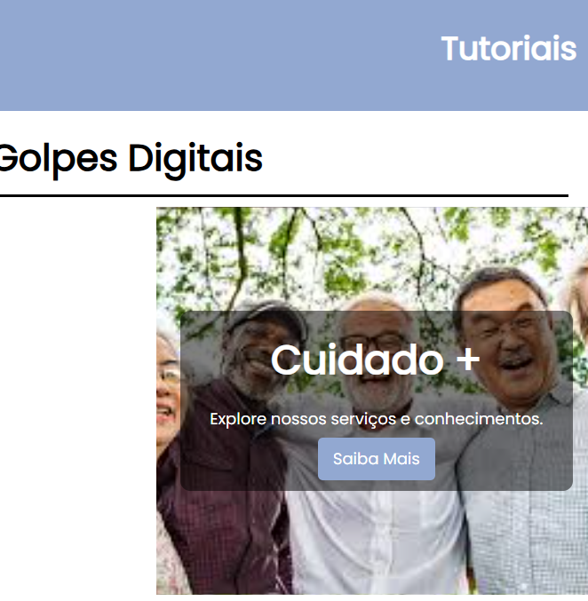
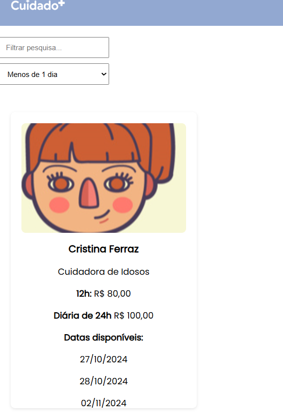
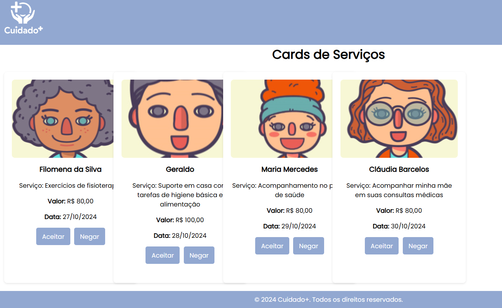
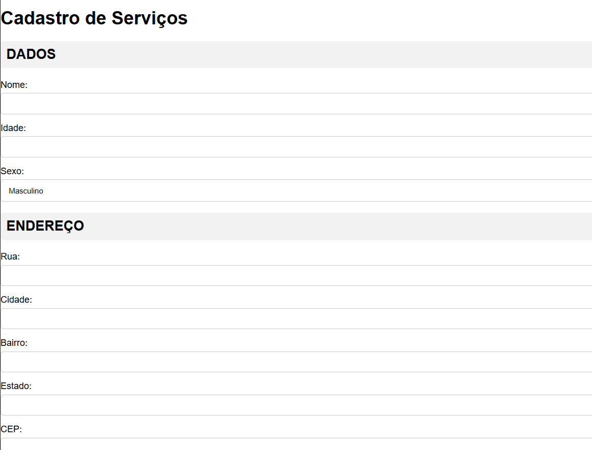
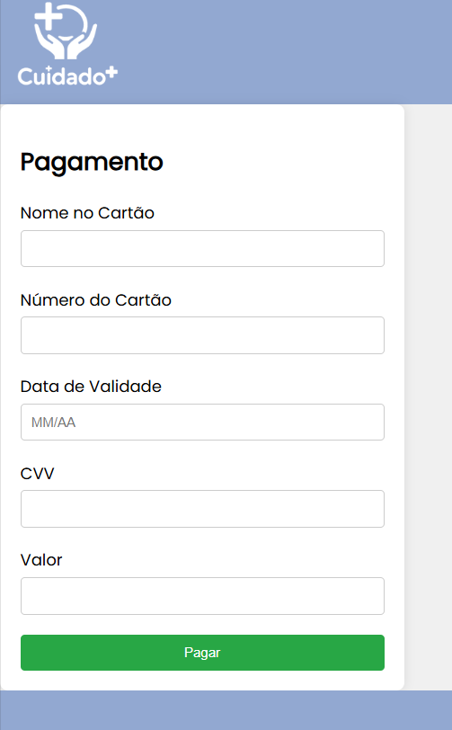
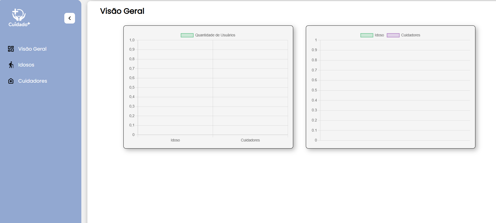

# Arquitetura da solução

<span style="color:red">Pré-requisitos: <a href="05-Projeto-interface.md"> Projeto de interface</a></span>

Definição de como o software é estruturado em termos dos componentes que fazem parte da solução e do ambiente de hospedagem da aplicação.


## Funcionalidades

Esta seção apresenta as funcionalidades da solução.

##### Funcionalidades

Permite a inclusão, leitura, alteração e exclusão de contatos para o sistema

* **Estrutura de dados:** [Banner](#Banner---Ivan*)
* **Instruções de acesso:**
  * O Banner e estatico;
  * Acesse a pagina de tutoriais atraves dela sera possivel ver o Banner no topo da tela;
  * Ao recarregar a pagina a imagem mudara aleatoriamente".
* **Tela da funcionalidade**:


* **Estrutura de dados:** [Carrousel](#Carrousel---Erik*)
* **Instruções de acesso:**
  * O Carrousel exibe informações para os idosos;
  * Acesse a pagina principal atraves dela sera possivel ver o Carrousel no topo da tela;
  * Ao recarregar a pagina a imagem mudara aleatoriamente".
* **Tela da funcionalidade**:


* **Estrutura de dados:** [Filtro](#filtro---rodrigo*)
* **Instruções de acesso:**
  * O filtro de pesquisa permite procurar serviços especificos;
  * Por exemplo ao acesse a pagina de tutoriais atraves dela sera possivel ver o filtro de pesquisa a direita ;
  * As informações irão aparecer de acordo com as pesquisas".
* **Tela da funcionalidade**:


* **Estrutura de dados:** [Avaliações](Franklin---avaliações*)
* **Instruções de acesso:**
  * atraves de botoes e possivel avaliar os serviços de um cuidador de idosos;
* **Tela da funcionalidade**:


* **Estrutura de dados:** [Tela do cuidador](#tela-do-cuidador---Ivan*)
* **Instruções de acesso:**
  * Apos a postagem de serviços pelos idosos estes serviços estarão disponiveis na tela do cuidador;
  * e possivel aceitae ou negar oserviço ;
* **Tela da funcionalidade**:


* **Estrutura de dados:** [Cadastro](#cadastro---Lucas*)
* **Instruções de acesso:**
  * O Banner e estatico;
  * Acesse a pagina de tutoriais atraves dela sera possivel ver o Banner no topo da tela;
  * Ao recarregar a pagina a imagem mudara aleatoriamente".
* **Tela da funcionalidade**:


* **Estrutura de dados:** [Pagamento](#Formas-de-pagamento---Lucas*)
* **Instruções de acesso:**
  * O Banner e estatico;
  * Acesse a pagina de tutoriais atraves dela sera possivel ver o Banner no topo da tela;
  * Ao recarregar a pagina a imagem mudara aleatoriamente".
* **Tela da funcionalidade**:


* **Estrutura de dados:** [Banner](#Banner---Ivan*)
* **Instruções de acesso:**
  * O Banner e estatico;
  * Acesse a pagina de tutoriais atraves dela sera possivel ver o Banner no topo da tela;
  * Ao recarregar a pagina a imagem mudara aleatoriamente".
* **Tela da funcionalidade**:


* **Estrutura de dados:** [POstagem](#Postagem-de-serviços---Rodrigo*)
* **Instruções de acesso:**
  * O Banner e estatico;
  * Acesse a pagina de tutoriais atraves dela sera possivel ver o Banner no topo da tela;
  * Ao recarregar a pagina a imagem mudara aleatoriamente".
* **Tela da funcionalidade**:


* **Estrutura de dados:** [Banner](#Pagina-de-administração---Erik*)
* **Instruções de acesso:**
  * O Banner e estatico;
  * Acesse a pagina de tutoriais atraves dela sera possivel ver o Banner no topo da tela;
  * Ao recarregar a pagina a imagem mudara aleatoriamente".
* **Tela da funcionalidade**:



### Estruturas de dados

Descrição das estruturas de dados utilizadas na solução com exemplos no formato JSON.Info.

##### Estrutura de dados - Contatos

Contatos da aplicação

```json

[
    {
        "image": "imagens/slide1.jpeg",
        "link": "teste.html",
        "text": "Contratação de Serviços"
    },
    {
        "image": "imagens/slide2.jpeg",
        "link": "teste.html",
        "text": "Tutoriais"
    },
    {
        "image": "imagens/slide3.jpeg",
        "link": "teste.html",
        "text": "Alertas contra Golpes"
    }
  ]
  
```

##### Estrutura de dados - Usuários 

Registro dos usuários do sistema utilizados para login e para o perfil do sistema. 
"este Json nao esta vinculado com nosso site ele e uma implementacao futura, mas de qualquer forma sera adicionado ao develop e main"

```json
 {
    "body": {
      "main": {
        "container": {
          "section": {
            "header": {
              "h2": "Nova conta"
            }
          },
          "form": {
            "id": "form",
            "class": "form",
            "fields": [
              {
                "label": "Nome do usuário",
                "input": {
                  "type": "text",
                  "id": "username",
                  "placeholder": "Digite o nome do usuario..."
                },
                "errorMessage": "Aqui vai a mensagem de erro...."
              },
              {
                "label": "Email",
                "input": {
                  "type": "email",
                  "id": "email",
                  "placeholder": "Digite o seu email..."
                },
                "errorMessage": "Aqui vai a mensagem de erro...."
              },
              {
                "label": "Senha",
                "input": {
                  "type": "password",
                  "id": "password",
                  "placeholder": "Digite sua senha..."
                },
                "errorMessage": "Aqui vai a mensagem de erro...."
              },
              {
                "label": "Confirmação de senha",
                "input": {
                  "type": "password",
                  "id": "password-confirmation",
                  "placeholder": "Digite sua senha novamente..."
                },
                "errorMessage": "Aqui vai a mensagem de erro...."
              },
              {
                "label": "Endereço",
                "inputs": [
                  {
                    "type": "text",
                    "id": "street",
                    "placeholder": "Digite sua rua..."
                  },
                  {
                    "type": "text",
                    "id": "neighborhood",
                    "placeholder": "Digite seu bairro..."
                  },
                  {
                    "type": "text",
                    "id": "city",
                    "placeholder": "Digite sua cidade..."
                  }
                ],
                "errorMessage": "Aqui vai a mensagem de erro...."
              },
              {
                "label": "Profissão",
                "input": {
                  "type": "text",
                  "id": "profession",
                  "placeholder": "Digite sua profissão..."
                },
                "errorMessage": "Aqui vai a mensagem de erro...."
              }
            ],
            "submitButton": {
              "type": "submit",
              "text": "Cadastrar",
              "link": "login.html"
            }
          }
        }
      },
      "script": {
        "src": "/src/public/assets/js/cadastro.js"
      }
    }
  }

  
```

