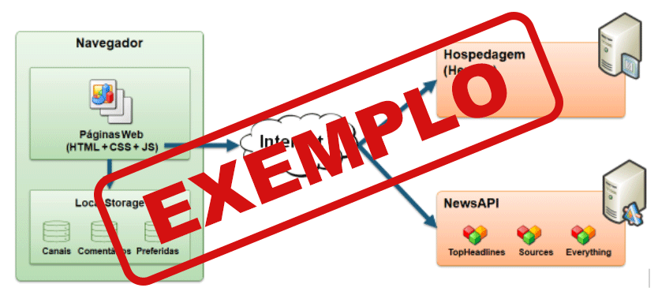

# Arquitetura da solução

<span style="color:red">Pré-requisitos: <a href="05-Projeto-interface.md"> Projeto de interface</a></span>

Definição de como o software é estruturado em termos dos componentes que fazem parte da solução e do ambiente de hospedagem da aplicação.



## Funcionalidades

Esta seção apresenta as funcionalidades da solução.

##### Funcionalidades

Permite a inclusão, leitura, alteração e exclusão de contatos para o sistema

* **Estrutura de dados:** [Banner](#Banner---Ivan*)
* **Instruções de acesso:**
  * O Banner e estatico;
  * Acesse a pagina de tutoriais atraves dela sera possivel ver o Banner no topo da tela;
  * Ao recarregar a pagina a imagem mudara aleatoriamente".
* **Tela da funcionalidade**:

* **Estrutura de dados:** [Carrousel](#Carrousel---Erik*)
* **Instruções de acesso:**
  * O Carrousel exibe informações para os idosos;
  * Acesse a pagina principal atraves dela sera possivel ver o Carrousel no topo da tela;
  * Ao recarregar a pagina a imagem mudara aleatoriamente".
* **Tela da funcionalidade**:

* **Estrutura de dados:** [Filtro](#filtro---rodrigo*)
* **Instruções de acesso:**
  * O filtro de pesquisa permite procurar serviços especificos;
  * Por exemplo ao acesse a pagina de tutoriais atraves dela sera possivel ver o filtro de pesquisa a direita ;
  * As informações irão aparecer de acordo com as pesquisas".
* **Tela da funcionalidade**:


* **Estrutura de dados:** [Avaliações](Franklin---avaliações*)
* **Instruções de acesso:**
  * atraves de botoes e possivel avaliar os serviços de um cuidador de idosos;
* **Tela da funcionalidade**:


* **Estrutura de dados:** [Tela do cuidador](#tela-do-cuidador---Ivan*)
* **Instruções de acesso:**
  * Apos a postagem de serviços pelos idosos estes serviços estarão disponiveis na tela do cuidador;
  * e possivel aceitae ou negar oserviço ;
* **Tela da funcionalidade**:


* **Estrutura de dados:** [Cadastro](#cadastro---Lucas*)
* **Instruções de acesso:**
  * O Banner e estatico;
  * Acesse a pagina de tutoriais atraves dela sera possivel ver o Banner no topo da tela;
  * Ao recarregar a pagina a imagem mudara aleatoriamente".
* **Tela da funcionalidade**:


* **Estrutura de dados:** [Pagamento](#Formas-de-pagamento---Lucas*)
* **Instruções de acesso:**
  * O Banner e estatico;
  * Acesse a pagina de tutoriais atraves dela sera possivel ver o Banner no topo da tela;
  * Ao recarregar a pagina a imagem mudara aleatoriamente".
* **Tela da funcionalidade**:


* **Estrutura de dados:** [Banner](#Banner---Ivan*)
* **Instruções de acesso:**
  * O Banner e estatico;
  * Acesse a pagina de tutoriais atraves dela sera possivel ver o Banner no topo da tela;
  * Ao recarregar a pagina a imagem mudara aleatoriamente".
* **Tela da funcionalidade**:


* **Estrutura de dados:** [POstagem](#Postagem-de-serviços---Rodrigo*)
* **Instruções de acesso:**
  * O Banner e estatico;
  * Acesse a pagina de tutoriais atraves dela sera possivel ver o Banner no topo da tela;
  * Ao recarregar a pagina a imagem mudara aleatoriamente".
* **Tela da funcionalidade**:


* **Estrutura de dados:** [Banner](#Pagina-de-administração---Erik*)
* **Instruções de acesso:**
  * O Banner e estatico;
  * Acesse a pagina de tutoriais atraves dela sera possivel ver o Banner no topo da tela;
  * Ao recarregar a pagina a imagem mudara aleatoriamente".
* **Tela da funcionalidade**:


> ⚠️ **APAGUE ESTA PARTE ANTES DE ENTREGAR SEU TRABALHO**
>
> Apresente cada uma das funcionalidades que a aplicação fornece tanto para os usuários, quanto aos administradores da solução.
>
> Inclua, para cada funcionalidade, itens como: (1) títulos e descrição da funcionalidade; (2) estrutura de dados associada; (3) o detalhe sobre as instruções de acesso e uso.

### Estruturas de dados

Descrição das estruturas de dados utilizadas na solução com exemplos no formato JSON.Info.

##### Estrutura de dados - Contatos

Contatos da aplicação

```json
  {
    "id": 1,
    "nome": "Leanne Graham",
    "cidade": "Belo Horizonte",
    "categoria": "amigos",
    "email": "Sincere@april.biz",
    "telefone": "1-770-736-8031",
    "website": "hildegard.org"
  }
  
```

##### Estrutura de dados - Usuários  ⚠️ EXEMPLO ⚠️

Registro dos usuários do sistema utilizados para login e para o perfil do sistema.

```json
  {
    id: "eed55b91-45be-4f2c-81bc-7686135503f9",
    email: "admin@abc.com",
    id: "eed55b91-45be-4f2c-81bc-7686135503f9",
    login: "admin",
    nome: "Administrador do Sistema",
    senha: "123"
  }
```

> ⚠️ **APAGUE ESTA PARTE ANTES DE ENTREGAR SEU TRABALHO**
>
> Apresente as estruturas de dados utilizadas na solução tanto para dados utilizados na essência da aplicação, quanto outras estruturas que foram criadas para algum tipo de configuração.
>
> Nomeie a estrutura, coloque uma descrição sucinta e apresente um exemplo em formato JSON.
>
> **Orientações:**
>
> * [JSON Introduction](https://www.w3schools.com/js/js_json_intro.asp)
> * [Trabalhando com JSON - Aprendendo desenvolvimento web | MDN](https://developer.mozilla.org/pt-BR/docs/Learn/JavaScript/Objects/JSON)

### Módulos e APIs

Esta seção apresenta os módulos e APIs utilizados na solução.

**Images**:

* Unsplash - [https://unsplash.com/](https://unsplash.com/) ⚠️ EXEMPLO ⚠️

**Fonts:**

* Icons Font Face - [https://fontawesome.com/](https://fontawesome.com/) ⚠️ EXEMPLO ⚠️

**Scripts:**

* jQuery - [http://www.jquery.com/](http://www.jquery.com/) ⚠️ EXEMPLO ⚠️
* Bootstrap 4 - [http://getbootstrap.com/](http://getbootstrap.com/) ⚠️ EXEMPLO ⚠️

> ⚠️ **APAGUE ESTA PARTE ANTES DE ENTREGAR SEU TRABALHO**
>
> Apresente os módulos e APIs utilizados no desenvolvimento da solução. Inclua itens como: (1) frameworks, bibliotecas, módulos, etc. utilizados no desenvolvimento da solução; (2) APIs utilizadas para acesso a dados, serviços, etc.


## Hospedagem

Explique como a hospedagem e o lançamento da plataforma foram realizados.

> **Links úteis**:
> - [Website com GitHub Pages](https://pages.github.com/)
> - [Programação colaborativa com Repl.it](https://repl.it/)
> - [Getting started with Heroku](https://devcenter.heroku.com/start)
> - [Publicando seu site no Heroku](http://pythonclub.com.br/publicando-seu-hello-world-no-heroku.html)
