# Registro de testes de software

Pré-requisitos: <a href="05-Projeto-interface.md"> Projeto de interface</a>, <a href="08-Plano-testes-software.md"> Plano de testes de software</a>

Relatório com as evidências dos testes de software realizados no sistema pela equipe, baseado em um plano de testes pré-definido.

Para cada caso de teste definido no <a href="08-Plano-testes-software.md"> Plano de testes de software</a>, realize o registro das evidências dos testes feitos na aplicação pela equipe, que comprovem que o critério de êxito foi alcançado (ou não!). Para isso, utilize uma ferramenta de captura de tela que mostre cada um dos casos de teste definidos. Observação: cada caso de teste deverá possuir um vídeo do tipo _screencast_ para caracterizar uma evidência do referido caso.

| **Caso de teste** 	| **CT-001 – Cadastrar perfil** 	|
|:---:	|:---:	|
| Requisito associado | RF-01X - Permitir o cadastro de perfil para clientes e profissionais. |
| Registro de evidência | 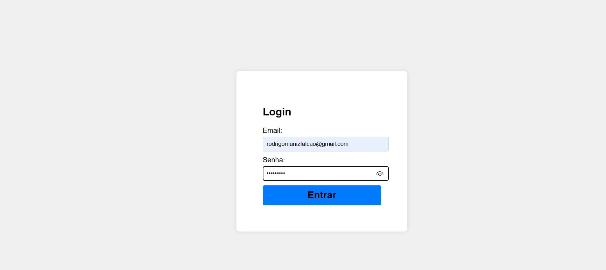 | 
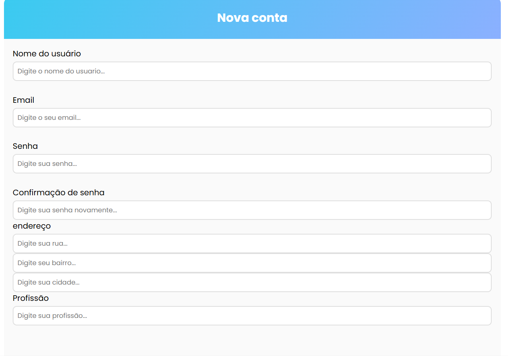.

| **Caso de teste** 	| **CT-002 – Filtro ** 	|
|:---:	|:---:	|
| Requisito associado | RF-02Y -  Filtro para escolha e contratação de profissionais. |
| Registro de evidência | 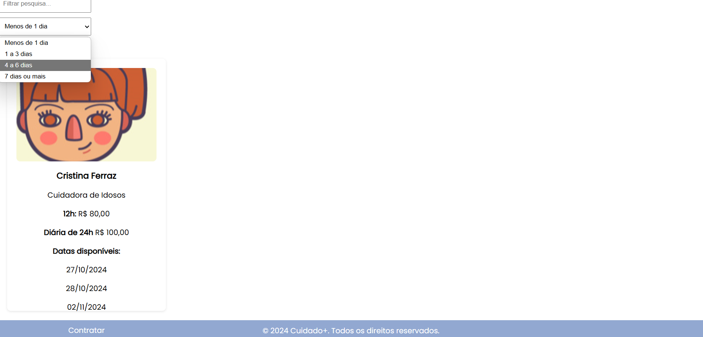 |

| **Caso de teste** 	| **CT-003 – Cadastro de Serviços ** 	|
|:---:	|:---:	|
| Requisito associado | RF-03Y - Permitir o usuário poste os serviços desejados |
| Registro de evidência | 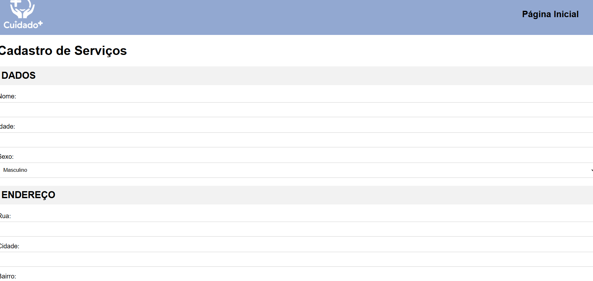 |

| **Caso de teste** 	| **CT-004 – Barra de pesquisa ** 	|
|:---:	|:---:	|
| Requisito associado | RF-04Y - Barra de pesquisa para buscar informações |
| Registro de evidência | 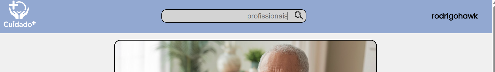 |

| **Caso de teste** 	| **CT-005 – Avaliação ** 	|
|:---:	|:---:	|
| Requisito associado | RF-05Y -  Permitir avaliação de cliente e profissionais. |
| Registro de evidência | 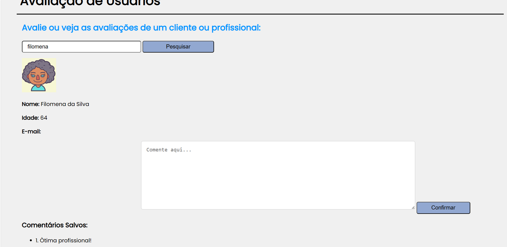 |

| **Caso de teste** 	| **CT-006 – Carrosel ** 	|
|:---:	|:---:	|
| Requisito associado | RF-06Y -  Carrosel com slides que encaminham para a página do site. |
| Registro de evidência | 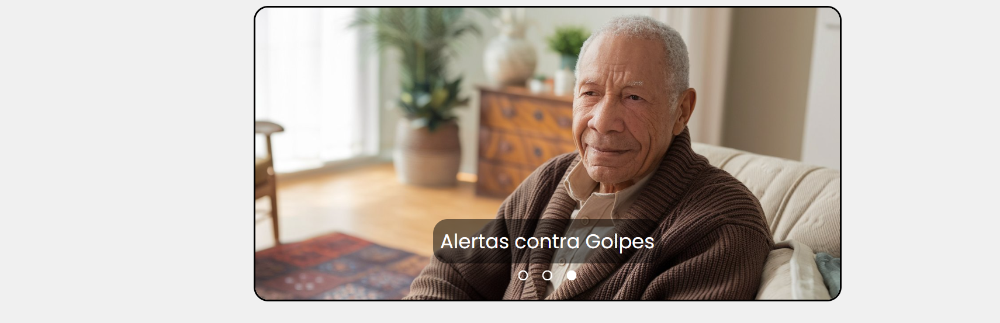 |

| **Caso de teste** 	| **CT-007 – Banner ** 	|
|:---:	|:---:	|
| Requisito associado | RF-07Y -  Banner para tutoriais de alertas contra golpes digitais. |
| Registro de evidência | 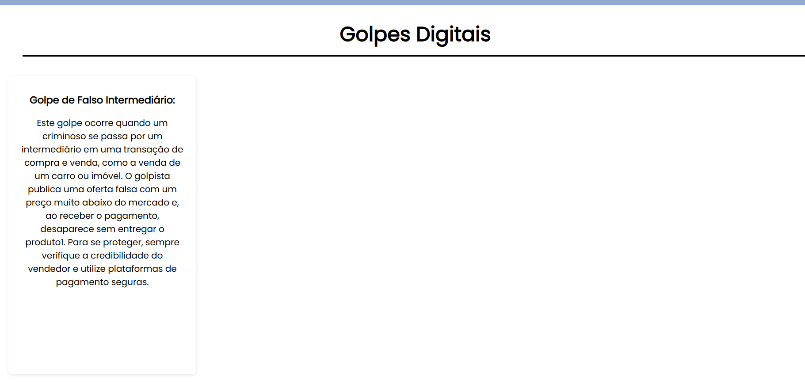 |

| **Caso de teste** 	| **CT-008 – Formas de pagamento ** 	|
|:---:	|:---:	|
| Requisito associado | RF-08Y -  Formas de pagamento |
| Registro de evidência | 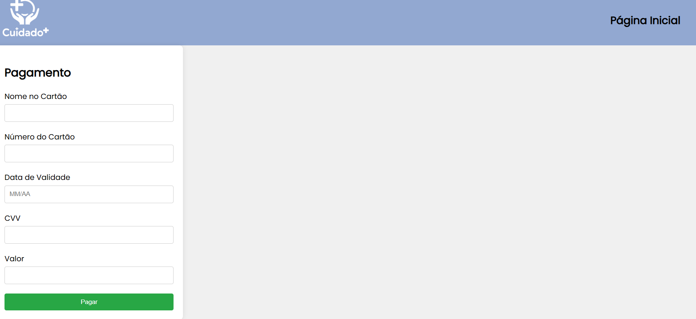 |

| **Caso de teste** 	| **CT-009 – Página de administrador** 	|
|:---:	|:---:	|
| Requisito associado | RF-09Y -   Página de administrador. |
| Registro de evidência | 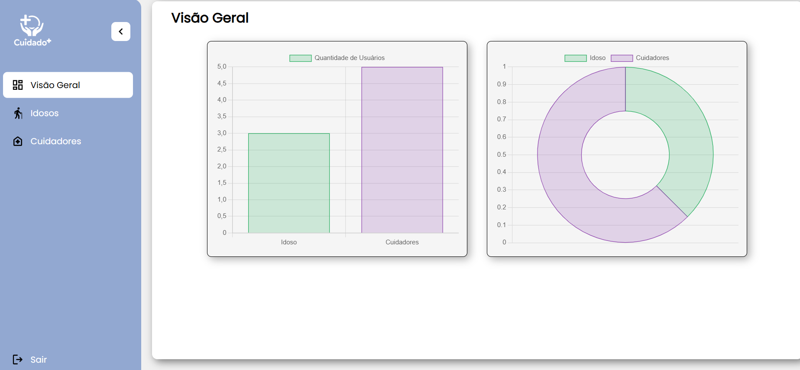 |
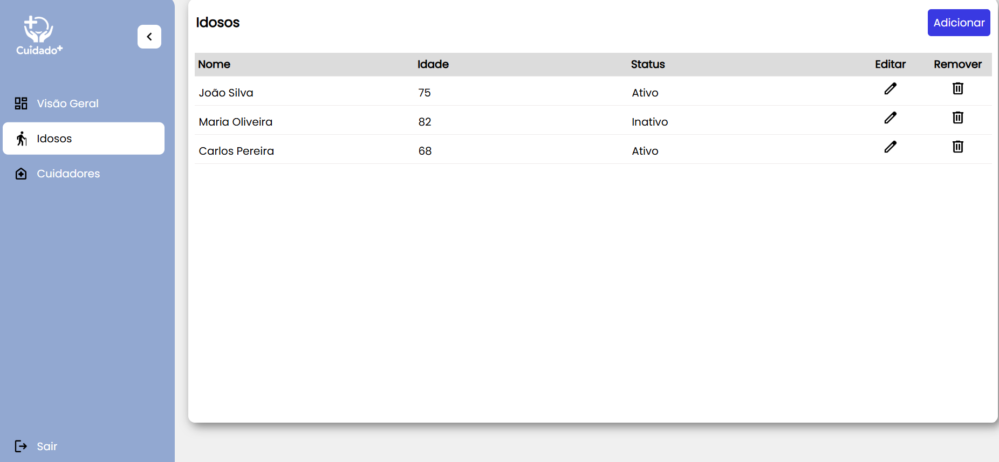 |

| **Caso de teste** 	| **CT-010 – Serviços dispoíveis ** 	|
|:---:	|:---:	|
| Requisito associado | RF-02Y -  Cards com serviços disponíveis para o cuidador. |
| Registro de evidência | 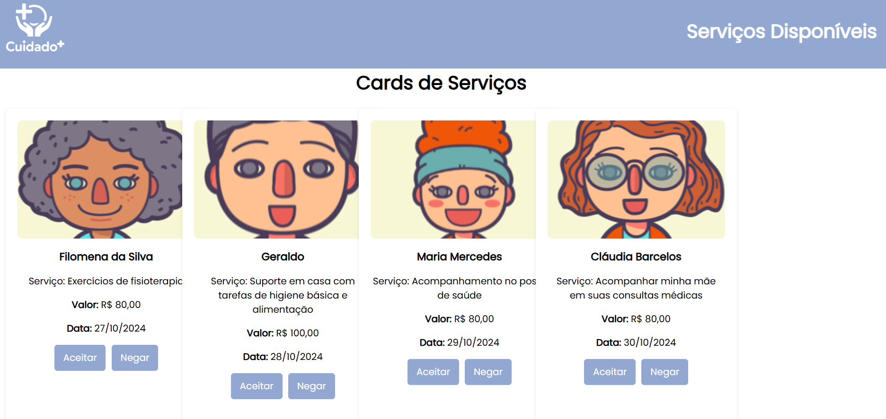 |

## Avaliação

Concliuimos que para as próximas iterações devemos nos responsabilizar mais em relação as funcionalidades do projeto. Como ponto forte gostariamos de destacar uma interface limpa e agradavel para nosso projeto e em relação a pontos negativos uma melhor organização nas funcionalidades.
